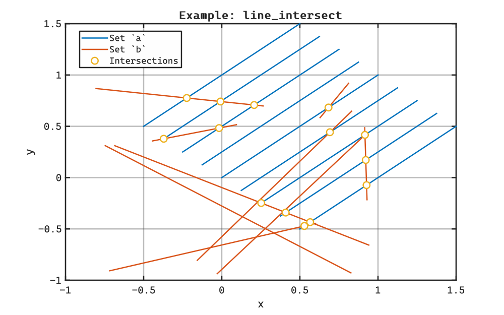
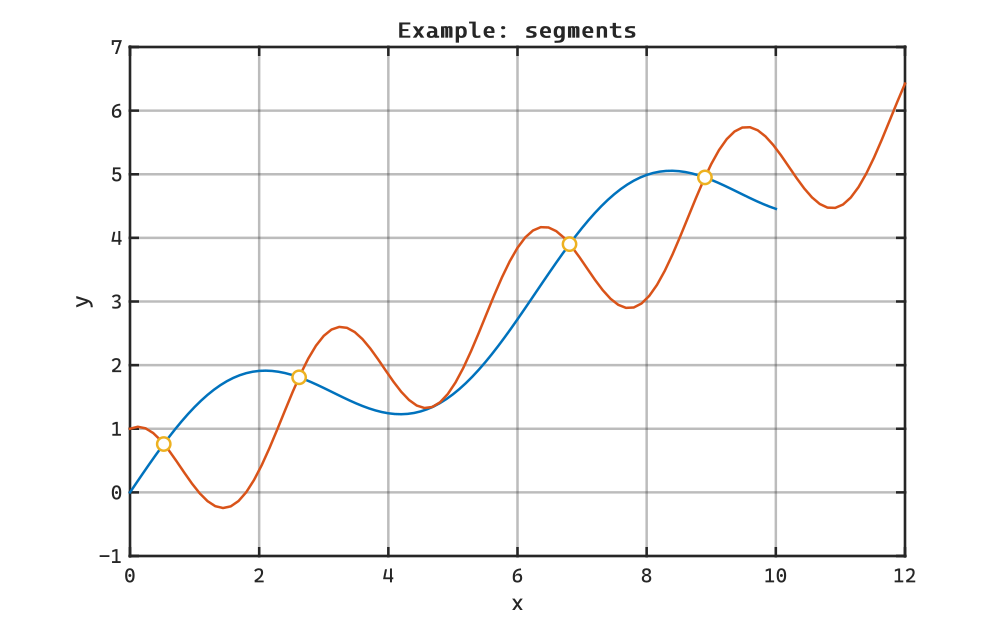

# MatlabLineIntersection

[](https://www.mathworks.com/matlabcentral/fileexchange/172409-matlablineintersection) or [](https://matlab.mathworks.com/open/github/v1?repo=btmy87/MatlabLineIntersection&file=README.mlx)


[](https://github.com/btmy87/MatlabLineIntersection/actions/workflows/Testing.yml)


[](https://gist.githubusercontent.com/btmy87/0f25477c0a3820599438e573cee862a3/raw/badge.svg)


Line Segment Intersection in MatLab


Finds intersection points between two sets of line segments.  Returns nan where there is no intersection or segments are colinear.

# Example: Two sets of Line Segments

Find the intersection points between two sets of line setments

```matlab

n = 9;

% first the 'a' set, we'll use a set of parallel lines
xa = [0; 1] - linspace(-0.5, 0.5, n);
ya = [0; 1] + linspace(-0.5, 0.5, n);

% now the 'b' set, random segments
rng("default"); % want a repeatable result
xb = (rand(2, n) - 0.5)*2;
yb = (rand(2, n) - 0.5)*2;

% find the intersections
[xi, yi] = line_intersect(xa, ya, xb, yb);

figure; 
ha = axes; hold on;
xlabel("x"); ylabel("y");
title("Example: line_intersect", Interpreter="none");
h1 = plot(xa, ya, "-", DisplayName="Set `a`", Color=ha.ColorOrder(1, :));
h2 = plot(xb, yb, "-", DisplayName="Set `b`", Color=ha.ColorOrder(2, :));
h3 = plot(xi, yi, "o", DisplayName="Intersections", Color=ha.ColorOrder(3, :));
legend([h1(1), h2(1), h3(1)], Location="best");
```

<picture>
  <source media="(prefers-color-scheme: dark)" srcset="resources/README_0_dark.svg">
  <source media="(prefers-color-scheme: light)" srcset="resources/README_0_light.svg">
  
</picture>

# Example: Intersections Between Polylines

Find the intersections between two polylines.

```matlab
% make our input curves
xa = linspace(0, 10, 101);
ya = sin(xa) + 0.5*xa;

xb = linspace(0, 12, 101);
yb = cos(2*xb) + 0.5*xb;

% find our intersections
[xv, yv] = line_intersect(segments(xa), segments(ya), ...
                          segments(xb), segments(yb));

% xv and yv are large matrices, but mostly nan.  might want to clean up
idx = ~isnan(xv(:));
xv1 = xv(idx);
yv1 = yv(idx);

% plot
figure;
axes;hold on;
xlabel("x"); ylabel("y");
title("Example: segments");
plot(xa, ya);
plot(xb, yb);
plot(xv1(:), yv1(:), "o")
```

<picture>
  <source media="(prefers-color-scheme: dark)" srcset="resources/README_1_dark.svg">
  <source media="(prefers-color-scheme: light)" srcset="resources/README_1_light.svg">
  
</picture>

# Alternatives

There are several functions on the file exchange that calculate the intersections, but most do not handle all intersections between two sets.  The closest is the link below.  The version provided in this repository is moderately faster for large sets, thousands of lines.  This is due to modern MATLAB array expansion techniques and fewer outputs.  If you need information on whether line segments are parallel or coincident, the version below is recommended.


[https://www.mathworks.com/matlabcentral/fileexchange/27205\-fast\-line\-segment\-intersection](https://www.mathworks.com/matlabcentral/fileexchange/27205-fast-line-segment-intersection)

